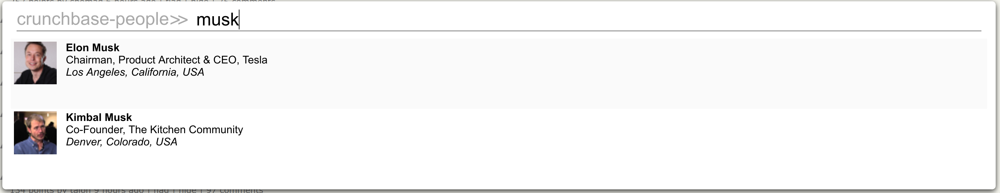

<!--

NOTICE:
This is an automatically generated file - Do not edit it directly.
The source file is README.tmpl.md

-->
Maddy's SurfingKeys Configuration
=================================

[](http://commitizen.github.io/cz-cli/)

This is my personal configuration for the wonderful [SurfingKeys](https://github.com/brookhong/Surfingkeys) browser extension.

Its primary features include [keybindings for performing common actions](#site-specific-key-mappings) on many popular
sites, as well as OmniBar support for [auto-completing searches](#bundled-search-engine-completions) within 44 sites (and growing)!

Table of Contents
-----------------

1. [Site-Specific Key Mappings](#site-specific-key-mappings)
2. [Bundled Search Engine Completions](#bundled-search-engine-completions)
3. [Installation Instructions](#installation)
4. [Screenshots](#screenshots)
5. [Todo](#todo)
6. [License](#license)

Features
--------

### Site-Specific Key Mappings

181 key mappings for 16 unique
sites have been included which can help you perform some common actions:

<table>
<tbody>
<tr><th colspan="2"><strong>global</strong></th></tr><tr><td><strong>Mapping</strong></td><td><strong>Description</strong></td></tr>
<tr><td><code>w</code></td><td>Scroll up</td></tr>
<tr><td><code>s</code></td><td>Scroll down</td></tr>
<tr><td><code>gi</code></td><td>Edit current URL with vim editor</td></tr>
<tr><td><code>gi</code></td><td>Edit current URL with vim editor</td></tr>
<tr><td><code>gI</code></td><td>View image in new tab</td></tr>
<tr><td><code>yp</code></td><td>Copy URL path of current page</td></tr>
<tr><td><code>yI</code></td><td>Copy Image URL</td></tr>
<tr><td><code>;se</code></td><td>Edit Settings</td></tr>
<tr><td><code>gS</code></td><td>Open Chrome settings</td></tr>
<tr><td><code>&#x3D;w</code></td><td>Lookup whois information for domain</td></tr>
<tr><td><code>&#x3D;d</code></td><td>Lookup dns information for domain</td></tr>
<tr><td><code>&#x3D;D</code></td><td>Lookup all information for domain</td></tr>
<tr><td><code>;pd</code></td><td>Toggle PDF viewer from SurfingKeys</td></tr>
<tr><th colspan="2"><a href="//amazon.com">amazon.com</a></th></tr><tr><td><strong>Mapping</strong></td><td><strong>Description</strong></td></tr>
<tr><td><code>&lt;Space&gt;fs</code></td><td>Fakespot</td></tr>
<tr><th colspan="2"><a href="//behance.net">behance.net</a></th></tr><tr><td><strong>Mapping</strong></td><td><strong>Description</strong></td></tr>
<tr><td><code>&lt;Space&gt;s</code></td><td>Appreciate project</td></tr>
<tr><td><code>&lt;Space&gt;b</code></td><td>Add project to collection</td></tr>
<tr><td><code>&lt;Space&gt;a</code></td><td>View project</td></tr>
<tr><td><code>&lt;Space&gt;A</code></td><td>View project (new tab)</td></tr>
<tr><th colspan="2"><a href="//dribbble.com">dribbble.com</a></th></tr><tr><td><strong>Mapping</strong></td><td><strong>Description</strong></td></tr>
<tr><td><code>&lt;Space&gt;s</code></td><td>Heart Shot</td></tr>
<tr><td><code>&lt;Space&gt;a</code></td><td>View shot</td></tr>
<tr><td><code>&lt;Space&gt;A</code></td><td>View shot (new tab)</td></tr>
<tr><td><code>&lt;Space&gt;v</code></td><td>View attachment image</td></tr>
<tr><td><code>&lt;Space&gt;V</code></td><td>Yank attachment image source URL</td></tr>
<tr><td><code>&lt;Space&gt;z</code></td><td>Zoom shot</td></tr>
<tr><th colspan="2"><a href="//fonts.adobe.com">fonts.adobe.com</a></th></tr><tr><td><strong>Mapping</strong></td><td><strong>Description</strong></td></tr>
<tr><td><code>&lt;Space&gt;a</code></td><td>Activate font</td></tr>
<tr><td><code>&lt;Space&gt;s</code></td><td>Favorite font</td></tr>
<tr><th colspan="2"><a href="//github.com">github.com</a></th></tr><tr><td><strong>Mapping</strong></td><td><strong>Description</strong></td></tr>
<tr><td><code>&lt;Space&gt;a</code></td><td>View Repository</td></tr>
<tr><td><code>&lt;Space&gt;u</code></td><td>View User</td></tr>
<tr><td><code>&lt;Space&gt;f</code></td><td>View File</td></tr>
<tr><td><code>&lt;Space&gt;i</code></td><td>View Issue</td></tr>
<tr><td><code>&lt;Space&gt;gp</code></td><td>Go to parent</td></tr>
<tr><td><code>&lt;Space&gt;s</code></td><td>Toggle Star</td></tr>
<tr><td><code>&lt;Space&gt;S</code></td><td>Check Star</td></tr>
<tr><td><code>&lt;Space&gt;y</code></td><td>Copy Project Path</td></tr>
<tr><td><code>&lt;Space&gt;Y</code></td><td>Copy Project Path (including domain)</td></tr>
<tr><td><code>&lt;Space&gt;D</code></td><td>View GoDoc for Project</td></tr>
<tr><th colspan="2"><a href="//gitlab.com">gitlab.com</a></th></tr><tr><td><strong>Mapping</strong></td><td><strong>Description</strong></td></tr>
<tr><td><code>&lt;Space&gt;s</code></td><td>Toggle Star</td></tr>
<tr><td><code>&lt;Space&gt;y</code></td><td>Copy Project Path</td></tr>
<tr><td><code>&lt;Space&gt;Y</code></td><td>Copy Project Path (including domain)</td></tr>
<tr><td><code>&lt;Space&gt;D</code></td><td>View GoDoc for Project</td></tr>
<tr><th colspan="2"><a href="//google.com">google.com</a></th></tr><tr><td><strong>Mapping</strong></td><td><strong>Description</strong></td></tr>
<tr><td><code>&lt;Space&gt;a</code></td><td>Open search result</td></tr>
<tr><td><code>&lt;Space&gt;A</code></td><td>Open search result (new tab)</td></tr>
<tr><th colspan="2"><a href="//news.ycombinator.com">news.ycombinator.com</a></th></tr><tr><td><strong>Mapping</strong></td><td><strong>Description</strong></td></tr>
<tr><td><code>&lt;Space&gt;x</code></td><td>Collapse comment</td></tr>
<tr><td><code>&lt;Space&gt;X</code></td><td>Collapse next comment</td></tr>
<tr><td><code>&lt;Space&gt;s</code></td><td>Upvote</td></tr>
<tr><td><code>&lt;Space&gt;S</code></td><td>Downvote</td></tr>
<tr><td><code>&lt;Space&gt;a</code></td><td>View post (link)</td></tr>
<tr><td><code>&lt;Space&gt;A</code></td><td>View post (link) (new tab)</td></tr>
<tr><td><code>&lt;Space&gt;c</code></td><td>View post (comments)</td></tr>
<tr><td><code>&lt;Space&gt;C</code></td><td>View post (comments) (new tab)</td></tr>
<tr><td><code>&lt;Space&gt;p</code></td><td>Go to parent</td></tr>
<tr><th colspan="2"><a href="//producthunt.com">producthunt.com</a></th></tr><tr><td><strong>Mapping</strong></td><td><strong>Description</strong></td></tr>
<tr><td><code>&lt;Space&gt;a</code></td><td>View product (external)</td></tr>
<tr><td><code>&lt;Space&gt;v</code></td><td>View product</td></tr>
<tr><td><code>&lt;Space&gt;s</code></td><td>Upvote product</td></tr>
<tr><th colspan="2"><a href="//reddit.com">reddit.com</a></th></tr><tr><td><strong>Mapping</strong></td><td><strong>Description</strong></td></tr>
<tr><td><code>&lt;Space&gt;x</code></td><td>Collapse comment</td></tr>
<tr><td><code>&lt;Space&gt;X</code></td><td>Collapse next comment</td></tr>
<tr><td><code>&lt;Space&gt;s</code></td><td>Upvote</td></tr>
<tr><td><code>&lt;Space&gt;S</code></td><td>Downvote</td></tr>
<tr><td><code>&lt;Space&gt;e</code></td><td>Expand expando</td></tr>
<tr><td><code>&lt;Space&gt;a</code></td><td>View post (link)</td></tr>
<tr><td><code>&lt;Space&gt;A</code></td><td>View post (link) (new tab)</td></tr>
<tr><td><code>&lt;Space&gt;c</code></td><td>View post (comments)</td></tr>
<tr><td><code>&lt;Space&gt;C</code></td><td>View post (comments) (new tab)</td></tr>
<tr><th colspan="2"><a href="//twitter.com">twitter.com</a></th></tr><tr><td><strong>Mapping</strong></td><td><strong>Description</strong></td></tr>
<tr><td><code>&lt;Space&gt;f</code></td><td>Follow user</td></tr>
<tr><td><code>&lt;Space&gt;s</code></td><td>Like tweet</td></tr>
<tr><td><code>&lt;Space&gt;R</code></td><td>Retweet</td></tr>
<tr><td><code>&lt;Space&gt;c</code></td><td>Comment/Reply</td></tr>
<tr><td><code>&lt;Space&gt;t</code></td><td>New tweet</td></tr>
<tr><td><code>&lt;Space&gt;T</code></td><td>Tweet to</td></tr>
<tr><td><code>&lt;Space&gt;r</code></td><td>Load new tweets</td></tr>
<tr><td><code>&lt;Space&gt;g</code></td><td>Goto user</td></tr>
<tr><th colspan="2"><a href="//vimeo.com">vimeo.com</a></th></tr><tr><td><strong>Mapping</strong></td><td><strong>Description</strong></td></tr>
<tr><td><code>&lt;Space&gt;F</code></td><td>Toggle fullscreen</td></tr>
<tr><th colspan="2"><a href="//wikipedia.org">wikipedia.org</a></th></tr><tr><td><strong>Mapping</strong></td><td><strong>Description</strong></td></tr>
<tr><td><code>&lt;Space&gt;s</code></td><td>Toggle simple version of current article</td></tr>
<tr><th colspan="2"><a href="//yelp.com">yelp.com</a></th></tr><tr><td><strong>Mapping</strong></td><td><strong>Description</strong></td></tr>
<tr><td><code>&lt;Space&gt;fs</code></td><td>Fakespot</td></tr>
<tr><th colspan="2"><a href="//youtube.com">youtube.com</a></th></tr><tr><td><strong>Mapping</strong></td><td><strong>Description</strong></td></tr>
<tr><td><code>A</code></td><td>Open video</td></tr>
<tr><td><code>C</code></td><td>Open channel</td></tr>
<tr><td><code>gH</code></td><td>Goto homepage</td></tr>
<tr><td><code>F</code></td><td>Toggle fullscreen</td></tr>
<tr><td><code>&lt;Space&gt;</code></td><td>Play/pause</td></tr>

</tbody>
</table>

### Bundled Search Engine Completions

There are currently 44 Search Engine auto-completions.

You can access a Search Engine auto-completion by pressing the search leader key, which is `a` by default, followed by the search engine alias.

For example, to open the Wikipedia completion, you would type `awp` while in normal mode.

| Alias | Name | Domain | Screenshots |
| ----- | ---- | ------ | ----------- |
 | `af` | `archforums` | `Google Custom Search` |  |
 | `al` | `archlinux` | `www.archlinux.org` |  |
 | `au` | `AUR` | `aur.archlinux.org` |  |
 | `aw` | `archwiki` | `wiki.archlinux.org` |  |
 | `az` | `amazon` | `smile.amazon.com` |  |
 | `cl` | `craigslist` | `craigslist.org` |  |
 | `co` | `crunchbase-orgs` | `www.crunchbase.com` |  |
 | `cp` | `crunchbase-people` | `www.crunchbase.com` | [:framed_picture:](#crunchbase-people)  |
 | `cs` | `chromestore` | `chrome.google.com` |  |
 | `de` | `define` | `onelook.com` | [:framed_picture:](#define)  |
 | `dg` | `duckduckgo` | `duckduckgo.com` |  |
 | `dh` | `dockerhub` | `hub.docker.com` | [:framed_picture:](#dockerhub)  |
 | `do` | `domainr` | `domainr.com` | [:framed_picture:](#domainr)  |
 | `eb` | `ebay` | `www.ebay.com` |  |
 | `ex` | `exdocs` | `hex.pm` |  |
 | `gd` | `godoc` | `godoc.org` |  |
 | `gg` | `golang` | `Google Custom Search` |  |
 | `gh` | `github` | `github.com` | [:framed_picture:](#github)  |
 | `gi` | `google-images` | `www.google.com` |  |
 | `gl` | `google-lucky` | `www.google.com` |  |
 | `go` | `google` | `www.google.com` |  |
 | `gs` | `go-search` | `go-search.org` |  |
 | `gw` | `gowalker` | `gowalker.org` |  |
 | `ha` | `hackage` | `hackage.haskell.org` |  |
 | `hd` | `hexdocs` | `hex.pm` |  |
 | `hn` | `hackernews` | `hn.algolia.com` | [:framed_picture:](#hackernews)  |
 | `ho` | `hoogle` | `www.haskell.org` | [:framed_picture:](#hoogle)  |
 | `hw` | `haskellwiki` | `wiki.haskell.org` |  |
 | `hx` | `hex` | `hex.pm` |  |
 | `hy` | `hayoo` | `hayoo.fh-wedel.de` |  |
 | `jq` | `jquery` | `Google Custom Search` |  |
 | `md` | `mdn` | `developer.mozilla.org` | [:framed_picture:](#mdn)  |
 | `no` | `node` | `Google Custom Search` |  |
 | `np` | `npm` | `www.npmjs.com` | [:framed_picture:](#npm)  |
 | `ow` | `owasp` | `www.owasp.org` |  |
 | `re` | `reddit` | `www.reddit.com` |  |
 | `so` | `stackoverflow` | `stackoverflow.com` |  |
 | `th` | `thesaurus` | `www.onelook.com` | [:framed_picture:](#thesaurus)  |
 | `vw` | `vimwikia` | `vim.wikia.com` |  |
 | `wa` | `wolframalpha` | `www.wolframalpha.com` | [:framed_picture:](#wolframalpha) [:framed_picture:](#wolframalpha-2)  |
 | `wp` | `wikipedia` | `en.wikipedia.org` |  |
 | `ws` | `wikipedia-simple` | `simple.wikipedia.org` |  |
 | `yp` | `yelp` | `www.yelp.com` |  |
 | `yt` | `youtube` | `www.youtube.com` | [:framed_picture:](#youtube)  |


Installation
------------

### Dependencies

Building `surfingkeys-conf` requires a few dependencies to be installed:

- __Surfingkeys__ `^0.9.38`
- __git__
- __node__
- __gulp__

### Building & Installing

1. __Clone this repository__
	```shell
	$ git clone http://github.com/b0o/surfingkeys-conf
	$ cd surfingkeys-conf
	```

2. __Install the NodeJS build dependencies__
	```shell
	$ npm install
	```

3. __*(Optional)* Private API Key Configuration__

	Some Search Engine Auto-Completions require private API keys for access. These
	keys are defined in `conf.priv.js`, which is not itself included in this repository.
	An example configuration containing instructions on how to generate each API key
	can be found in [conf.priv.example.js](./conf.priv.example.js).

	Copy the example private configuration:

	```shell
	$ cp ./conf.priv.example.js ./conf.priv.js
	```

	Open `./conf.priv.js` in your favorite editor and follow the instructions inside:

	```shell
	$ vim ./conf.priv.js
	```

4. __Gulp Build/Install__
	```shell
	$ gulp install # OR "gulp build" to build to ./build/.surfingkeys without installing
	```

	This will build the final configuration file and place it at `~/.surfingkeys`.
	If you already have a file in that location, make sure you back it up first!

5. __Load your configuration into the SurfingKeys Extension__

	<details>
	<summary><strong>Option A</strong> <em>(recommended)</em>: Configure SurfingKeys to automatically load configuration file from disk</summary>

	- __I.__ Visit [`chrome://extensions/`](chrome://extensions/) and enable `Allow access to file URLs` for the Surfingkeys extension

	- __II.__ Open the SurfingKeys [configuration page](chrome-extension://mffcegbjcdejldmihkogmcnkgbbhioid/pages/options.html)

	- __III.__ Set the `Load settings from` option to point to the configuration file.

		_Note: you must specify the full, absolute path; environment variables like `$HOME` or the tilde `~` won't work_:

		- __Linux__: `file:///home/{USERNAME}/.surfingkeys` (replace `{USERNAME}` with your username) 
		- __macOS__: `file:///Users/{USERNAME}/.surfingkeys` (replace `{USERNAME}` with your username) 
		- __Windows__: `file://%Homedrive%%Homepath%/.surfingkeys` (This is a guess, please correct me if I'm wrong)
	- __IV.__ Hack Away! If you ever make a change to any of your configuration files in the future, simply run `gulp install` again and your new configuration will automatically be loaded by SurfingKeys.

	</details>

	<details>
	<summary><strong>Option B</strong>: Manually copy/paste into the SurfingKeys configuration form</summary>

	- __I.__ Copy the contents of `./build/.surfingkeys` (or `$HOME/.surfingkeys` if you ran `gulp install`)

	- __II.__ Open the SurfingKeys [configuration page](chrome-extension://mffcegbjcdejldmihkogmcnkgbbhioid/pages/options.html)

	- __III.__ Paste into the text box, then press `save`

	- __IV.__ Repeat steps 4 & 5 after any changes you make to any of your configuration files.

	</details>

Screenshots
-----------
##### crunchbase-people


##### define


##### dockerhub


##### domainr


##### github


##### hackernews


##### hoogle


##### mdn


##### npm


##### thesaurus


##### wolframalpha


##### wolframalpha 2


##### youtube


Todo
----

- [ ] Add `CHANGELOG.md` using [conventional-changelog](https://github.com/conventional-changelog/conventional-changelog)
- [ ] Improve code organization
- [ ] Ensure screenshots have a plain white background
- [ ] Add additional screenshots
- [x] Simplify installation process
- [x] Feed the kittens

License
-------
&copy;2017-2018 Maddison Hellstrom - MIT License
