<!-- NOTICE: This file is auto-generated. Do not edit directly. -->

# Maddison's SurfingKeys Configuration

This is my configuration for the [SurfingKeys](https://github.com/brookhong/Surfingkeys) browser extension.

It includes:

- [267 key mappings for 104 unique websites](#site-specific-key-mappings) which **automate many common actions**.
- [Omnibar integration with 55 Search Engines and Knowledge Sources](#omnibar-search-engine-integrations), many of which include **inline images** and **instant answers**.

## Table of Contents

1. [Site-Specific Key Mappings](#site-specific-key-mappings)
2. [Omnibar Search Engine Integrations](#omnibar-search-engine-integrations)
3. [Installation Instructions](#installation)
4. [Screenshots](#screenshots)
5. [License](#license)

## Features

### Site-Specific Key Mappings

<table>
<tbody>
<tr><th colspan="2"><strong>global</strong></th></tr><tr><td><strong>Mapping</strong></td><td><strong>Description</strong></td></tr>
<tr><td><code>F</code></td><td>Open a link in non-active new tab</td></tr>
<tr><td><code>zf</code></td><td>Open link URL in vim editor</td></tr>
<tr><td><code>w</code></td><td>Scroll up</td></tr>
<tr><td><code>s</code></td><td>Scroll down</td></tr>
<tr><td><code>K</code></td><td>Scroll half page up</td></tr>
<tr><td><code>J</code></td><td>Scroll half page down</td></tr>
<tr><td><code>gh</code></td><td>Scroll to element targeted by URL hash</td></tr>
<tr><td><code>gi</code></td><td>Edit current URL with vim editor</td></tr>
<tr><td><code>gI</code></td><td>View image in new tab</td></tr>
<tr><td><code>g.</code></td><td>Go to parent domain</td></tr>
<tr><td><code>yp</code></td><td>Copy URL path of current page</td></tr>
<tr><td><code>yI</code></td><td>Copy Image URL</td></tr>
<tr><td><code>yA</code></td><td>Copy link as Markdown</td></tr>
<tr><td><code>yO</code></td><td>Copy page URL/Title as Org-mode link</td></tr>
<tr><td><code>yM</code></td><td>Copy page URL/Title as Markdown link</td></tr>
<tr><td><code>yT</code></td><td>Duplicate current tab (non-active new tab)</td></tr>
<tr><td><code>;se</code></td><td>Edit Settings</td></tr>
<tr><td><code>gS</code></td><td>Open Chrome settings</td></tr>
<tr><td><code>&#x3D;W</code></td><td>Lookup whois information for domain</td></tr>
<tr><td><code>&#x3D;d</code></td><td>Lookup dns information for domain</td></tr>
<tr><td><code>&#x3D;D</code></td><td>Lookup all information for domain</td></tr>
<tr><td><code>&#x3D;c</code></td><td>Show Google's cached version of page</td></tr>
<tr><td><code>&#x3D;a</code></td><td>Show Archive.org Wayback Machine for page</td></tr>
<tr><td><code>&#x3D;A</code></td><td>Show Alexa.com info for domain</td></tr>
<tr><td><code>&#x3D;s</code></td><td>View social discussions for page</td></tr>
<tr><td><code>&#x3D;S</code></td><td>View summary for page</td></tr>
<tr><td><code>&#x3D;o</code></td><td>Show outline.com version of page</td></tr>
<tr><td><code>&#x3D;bw</code></td><td>Show BuiltWith report for page</td></tr>
<tr><td><code>&#x3D;wa</code></td><td>Show Wappalyzer report for page</td></tr>
<tr><td><code>;pd</code></td><td>Toggle PDF viewer from SurfingKeys</td></tr>
<tr><td><code>gxE</code></td><td>Close tab to left</td></tr>
<tr><td><code>gxR</code></td><td>Close tab to right</td></tr>
<tr><td><code>\cgh</code></td><td>Open clipboard string as GitHub path (e.g. 'torvalds/linux')</td></tr>
<tr><td><code>F</code></td><td>Open a link in non-active new tab</td></tr>
<tr><td><code>oh</code></td><td>Open URL from history</td></tr>
<tr><th colspan="2"><a href="//algolia.com"> algolia.com</a></th></tr><tr><td><strong>Mapping</strong></td><td><strong>Description</strong></td></tr>
<tr><td><code>&lt;Space&gt;a</code></td><td>Open search result</td></tr>
<tr><th colspan="2"><a href="//amazon.com"> amazon.com</a></th></tr><tr><td><strong>Mapping</strong></td><td><strong>Description</strong></td></tr>
<tr><td><code>&lt;Space&gt;fs</code></td><td>Fakespot</td></tr>
<tr><td><code>&lt;Space&gt;a</code></td><td>View product</td></tr>
<tr><td><code>&lt;Space&gt;c</code></td><td>Add to Cart</td></tr>
<tr><td><code>&lt;Space&gt;R</code></td><td>View Product Reviews</td></tr>
<tr><td><code>&lt;Space&gt;Q</code></td><td>View Product Q&A</td></tr>
<tr><td><code>&lt;Space&gt;A</code></td><td>Open Account page</td></tr>
<tr><td><code>&lt;Space&gt;C</code></td><td>Open Cart page</td></tr>
<tr><td><code>&lt;Space&gt;O</code></td><td>Open Orders page</td></tr>
<tr><th colspan="2"><a href="//aur.archlinux.org"> aur.archlinux.org</a></th></tr><tr><td><strong>Mapping</strong></td><td><strong>Description</strong></td></tr>
<tr><td><code>&lt;Space&gt;a</code></td><td>View package</td></tr>
<tr><th colspan="2"><a href="//behance.net"> behance.net</a></th></tr><tr><td><strong>Mapping</strong></td><td><strong>Description</strong></td></tr>
<tr><td><code>&lt;Space&gt;s</code></td><td>Appreciate project</td></tr>
<tr><td><code>&lt;Space&gt;b</code></td><td>Add project to collection</td></tr>
<tr><td><code>&lt;Space&gt;a</code></td><td>View project</td></tr>
<tr><td><code>&lt;Space&gt;A</code></td><td>View project (non-active new tab)</td></tr>
<tr><th colspan="2"><a href="//bsky.app"> bsky.app</a></th></tr><tr><td><strong>Mapping</strong></td><td><strong>Description</strong></td></tr>
<tr><td><code>&lt;Space&gt;d</code></td><td>Copy user DID</td></tr>
<tr><td><code>&lt;Space&gt;p</code></td><td>Copy user post ID</td></tr>
<tr><th colspan="2"><a href="//chat.openai.com"> chat.openai.com</a></th></tr><tr><td><strong>Mapping</strong></td><td><strong>Description</strong></td></tr>
<tr><td><code>&lt;Space&gt;n</code></td><td>New chat</td></tr>
<tr><td><code>&lt;Space&gt;a</code></td><td>Open chat</td></tr>
<tr><th colspan="2"><a href="//claude.ai"> claude.ai</a></th></tr><tr><td><strong>Mapping</strong></td><td><strong>Description</strong></td></tr>
<tr><td><code>i</code></td><td>Focus input</td></tr>
<tr><th colspan="2"><a href="//craigslist.org"> craigslist.org</a></th></tr><tr><td><strong>Mapping</strong></td><td><strong>Description</strong></td></tr>
<tr><td><code>&lt;Space&gt;a</code></td><td>View listing</td></tr>
<tr><th colspan="2"><a href="//devdocs.io"> devdocs.io</a></th></tr><tr><td><strong>Mapping</strong></td><td><strong>Description</strong></td></tr>
<tr><td><code>w</code></td><td>Scroll sidebar up</td></tr>
<tr><td><code>s</code></td><td>Scroll sidebar down</td></tr>
<tr><td><code>e</code></td><td>Scroll sidebar page up</td></tr>
<tr><td><code>d</code></td><td>Scroll sidebar page down</td></tr>
<tr><td><code>k</code></td><td>Scroll body up</td></tr>
<tr><td><code>j</code></td><td>Scroll body down</td></tr>
<tr><td><code>K</code></td><td>Scroll body page up</td></tr>
<tr><td><code>J</code></td><td>Scroll body page down</td></tr>
<tr><th colspan="2"><a href="//duckduckgo.com"> duckduckgo.com</a></th></tr><tr><td><strong>Mapping</strong></td><td><strong>Description</strong></td></tr>
<tr><td><code>&lt;Space&gt;a</code></td><td>Open search result</td></tr>
<tr><td><code>&lt;Space&gt;A</code></td><td>Open search result (non-active new tab)</td></tr>
<tr><td><code>]]</code></td><td>Show more results</td></tr>
<tr><td><code>&lt;Space&gt;g</code></td><td>Open search in Google</td></tr>
<tr><td><code>&lt;Space&gt;sgh</code></td><td>Search site:github.com</td></tr>
<tr><td><code>&lt;Space&gt;sre</code></td><td>Search site:reddit.com</td></tr>
<tr><th colspan="2"><a href="//ebay.com"> ebay.com</a></th></tr><tr><td><strong>Mapping</strong></td><td><strong>Description</strong></td></tr>
<tr><td><code>&lt;Space&gt;fs</code></td><td>Fakespot</td></tr>
<tr><th colspan="2"><a href="//fonts.adobe.com"> fonts.adobe.com</a></th></tr><tr><td><strong>Mapping</strong></td><td><strong>Description</strong></td></tr>
<tr><td><code>&lt;Space&gt;a</code></td><td>Activate font</td></tr>
<tr><td><code>&lt;Space&gt;s</code></td><td>Favorite font</td></tr>
<tr><th colspan="2"><a href="//github.com"> github.com</a></th></tr><tr><td><strong>Mapping</strong></td><td><strong>Description</strong></td></tr>
<tr><td><code>&lt;Space&gt;A</code></td><td>Open repository Actions page</td></tr>
<tr><td><code>&lt;Space&gt;C</code></td><td>Open repository Commits page</td></tr>
<tr><td><code>&lt;Space&gt;I</code></td><td>Open repository Issues page</td></tr>
<tr><td><code>&lt;Space&gt;N</code></td><td>Open notifications page</td></tr>
<tr><td><code>&lt;Space&gt;P</code></td><td>Open repository Pull Requests page</td></tr>
<tr><td><code>&lt;Space&gt;R</code></td><td>Open Repository page</td></tr>
<tr><td><code>&lt;Space&gt;S</code></td><td>Open repository Settings page</td></tr>
<tr><td><code>&lt;Space&gt;W</code></td><td>Open repository Wiki page</td></tr>
<tr><td><code>&lt;Space&gt;X</code></td><td>Open repository Security page</td></tr>
<tr><td><code>&lt;Space&gt;O</code></td><td>Open repository Owner's profile page</td></tr>
<tr><td><code>&lt;Space&gt;M</code></td><td>Open your profile page ('Me')</td></tr>
<tr><td><code>&lt;Space&gt;a</code></td><td>View Repository</td></tr>
<tr><td><code>&lt;Space&gt;u</code></td><td>View User</td></tr>
<tr><td><code>&lt;Space&gt;f</code></td><td>View File</td></tr>
<tr><td><code>&lt;Space&gt;c</code></td><td>View Commit</td></tr>
<tr><td><code>&lt;Space&gt;i</code></td><td>View Issue</td></tr>
<tr><td><code>&lt;Space&gt;p</code></td><td>View Pull Request</td></tr>
<tr><td><code>&lt;Space&gt;e</code></td><td>View external link</td></tr>
<tr><td><code>gu</code></td><td>Go up one path in the URL (GitHub)</td></tr>
<tr><td><code>&lt;Space&gt;s</code></td><td>Toggle Star</td></tr>
<tr><td><code>&lt;Space&gt;yy</code></td><td>Copy Project Path</td></tr>
<tr><td><code>&lt;Space&gt;Y</code></td><td>Copy Project Path (including domain)</td></tr>
<tr><td><code>&lt;Space&gt;l</code></td><td>Toggle repo language stats</td></tr>
<tr><td><code>&lt;Space&gt;D</code></td><td>Open in github.dev (new tab)</td></tr>
<tr><td><code>&lt;Space&gt;dd</code></td><td>Open in github.dev</td></tr>
<tr><td><code>&lt;Space&gt;G</code></td><td>View on SourceGraph</td></tr>
<tr><td><code>&lt;Space&gt;r</code></td><td>View live raw version of file</td></tr>
<tr><td><code>&lt;Space&gt;yr</code></td><td>Copy raw link to file</td></tr>
<tr><td><code>&lt;Space&gt;yf</code></td><td>Copy link to file</td></tr>
<tr><td><code>&lt;Space&gt;gcp</code></td><td>Open clipboard string as file path in repo</td></tr>
<tr><th colspan="2"><a href="//github.io"> github.io</a></th></tr><tr><td><strong>Mapping</strong></td><td><strong>Description</strong></td></tr>
<tr><td><code>&lt;Space&gt;R</code></td><td>Open Repository page</td></tr>
<tr><th colspan="2"><a href="//gitlab.com"> gitlab.com</a></th></tr><tr><td><strong>Mapping</strong></td><td><strong>Description</strong></td></tr>
<tr><td><code>&lt;Space&gt;s</code></td><td>Toggle Star</td></tr>
<tr><td><code>&lt;Space&gt;y</code></td><td>Copy Project Path</td></tr>
<tr><td><code>&lt;Space&gt;Y</code></td><td>Copy Project Path (including domain)</td></tr>
<tr><td><code>&lt;Space&gt;D</code></td><td>View GoDoc for Project</td></tr>
<tr><th colspan="2"><a href="//home.nest.com"> home.nest.com</a></th></tr><tr><td><strong>Mapping</strong></td><td><strong>Description</strong></td></tr>
<tr><td><code>&#x3D;</code></td><td>Increment temperature</td></tr>
<tr><td><code>-</code></td><td>Decrement temperature</td></tr>
<tr><td><code>&lt;Space&gt;h</code></td><td>Switch mode to Heat</td></tr>
<tr><td><code>&lt;Space&gt;c</code></td><td>Switch mode to Cool</td></tr>
<tr><td><code>&lt;Space&gt;r</code></td><td>Switch mode to Heat/Cool</td></tr>
<tr><td><code>&lt;Space&gt;o</code></td><td>Switch mode to Off</td></tr>
<tr><td><code>&lt;Space&gt;f</code></td><td>Switch fan On</td></tr>
<tr><td><code>&lt;Space&gt;F</code></td><td>Switch fan Off</td></tr>
<tr><th colspan="2"><a href="//ikea.com"> ikea.com</a></th></tr><tr><td><strong>Mapping</strong></td><td><strong>Description</strong></td></tr>
<tr><td><code>&lt;Space&gt;d</code></td><td>Toggle Product Details</td></tr>
<tr><td><code>&lt;Space&gt;i</code></td><td>Toggle Product Details</td></tr>
<tr><td><code>&lt;Space&gt;r</code></td><td>Toggle Product Reviews</td></tr>
<tr><td><code>&lt;Space&gt;C</code></td><td>Open Cart page</td></tr>
<tr><td><code>&lt;Space&gt;P</code></td><td>Open Profile page</td></tr>
<tr><td><code>&lt;Space&gt;F</code></td><td>Open Favorites page</td></tr>
<tr><td><code>&lt;Space&gt;O</code></td><td>Open Orders page</td></tr>
<tr><th colspan="2"><a href="//news.ycombinator.com"> news.ycombinator.com</a></th></tr><tr><td><strong>Mapping</strong></td><td><strong>Description</strong></td></tr>
<tr><td><code>&lt;Space&gt;x</code></td><td>Collapse comment</td></tr>
<tr><td><code>&lt;Space&gt;X</code></td><td>Collapse next comment</td></tr>
<tr><td><code>&lt;Space&gt;s</code></td><td>Upvote</td></tr>
<tr><td><code>&lt;Space&gt;S</code></td><td>Downvote</td></tr>
<tr><td><code>&lt;Space&gt;a</code></td><td>View post (link)</td></tr>
<tr><td><code>&lt;Space&gt;A</code></td><td>View post (link and comments)</td></tr>
<tr><td><code>&lt;Space&gt;c</code></td><td>View post (comments)</td></tr>
<tr><td><code>&lt;Space&gt;C</code></td><td>View post (comments) (non-active new tab)</td></tr>
<tr><td><code>&lt;Space&gt;e</code></td><td>View external link</td></tr>
<tr><td><code>gp</code></td><td>Go to parent</td></tr>
<tr><td><code>]]</code></td><td>Next page</td></tr>
<tr><td><code>[[</code></td><td>Prev page</td></tr>
<tr><th colspan="2"><a href="//producthunt.com"> producthunt.com</a></th></tr><tr><td><strong>Mapping</strong></td><td><strong>Description</strong></td></tr>
<tr><td><code>&lt;Space&gt;a</code></td><td>View product (external)</td></tr>
<tr><td><code>&lt;Space&gt;v</code></td><td>View product</td></tr>
<tr><td><code>&lt;Space&gt;s</code></td><td>Upvote product</td></tr>
<tr><th colspan="2"><a href="//raw.githubusercontent.com"> raw.githubusercontent.com</a></th></tr><tr><td><strong>Mapping</strong></td><td><strong>Description</strong></td></tr>
<tr><td><code>&lt;Space&gt;R</code></td><td>Open Repository page</td></tr>
<tr><td><code>&lt;Space&gt;F</code></td><td>Open Source File</td></tr>
<tr><th colspan="2"><a href="//reddit.com"> reddit.com</a></th></tr><tr><td><strong>Mapping</strong></td><td><strong>Description</strong></td></tr>
<tr><td><code>&lt;Space&gt;x</code></td><td>Collapse comment</td></tr>
<tr><td><code>&lt;Space&gt;X</code></td><td>Collapse next comment</td></tr>
<tr><td><code>&lt;Space&gt;s</code></td><td>Upvote</td></tr>
<tr><td><code>&lt;Space&gt;S</code></td><td>Downvote</td></tr>
<tr><td><code>&lt;Space&gt;e</code></td><td>Expand expando</td></tr>
<tr><td><code>&lt;Space&gt;a</code></td><td>View post (link)</td></tr>
<tr><td><code>&lt;Space&gt;A</code></td><td>View post (link) (non-active new tab)</td></tr>
<tr><td><code>&lt;Space&gt;c</code></td><td>View post (comments)</td></tr>
<tr><td><code>&lt;Space&gt;C</code></td><td>View post (comments) (non-active new tab)</td></tr>
<tr><th colspan="2"><a href="//rescript-lang.org"> rescript-lang.org</a></th></tr><tr><td><strong>Mapping</strong></td><td><strong>Description</strong></td></tr>
<tr><td><code>i</code></td><td>Focus search field</td></tr>
<tr><td><code>&lt;Space&gt;a</code></td><td>Open docs link</td></tr>
<tr><td><code>&lt;Space&gt;L</code></td><td>Open language manual</td></tr>
<tr><td><code>&lt;Space&gt;R</code></td><td>Open ReScript + React docs</td></tr>
<tr><td><code>&lt;Space&gt;G</code></td><td>Open GenType docs</td></tr>
<tr><td><code>&lt;Space&gt;P</code></td><td>Open package index</td></tr>
<tr><td><code>&lt;Space&gt;Y</code></td><td>Open playground</td></tr>
<tr><td><code>&lt;Space&gt;S</code></td><td>Open syntax lookup</td></tr>
<tr><td><code>&lt;Space&gt;F</code></td><td>Open community forum</td></tr>
<tr><td><code>&lt;Space&gt;A</code></td><td>Open API docs</td></tr>
<tr><td><code>&lt;Space&gt;J</code></td><td>Open JS API docs</td></tr>
<tr><td><code>&lt;Space&gt;B</code></td><td>Open Belt API docs</td></tr>
<tr><td><code>&lt;Space&gt;D</code></td><td>Open DOM API docs</td></tr>
<tr><td><code>w</code></td><td>Scroll sidebar up</td></tr>
<tr><td><code>s</code></td><td>Scroll sidebar down</td></tr>
<tr><td><code>e</code></td><td>Scroll sidebar page up</td></tr>
<tr><td><code>d</code></td><td>Scroll sidebar page down</td></tr>
<tr><td><code>k</code></td><td>Scroll body up</td></tr>
<tr><td><code>j</code></td><td>Scroll body down</td></tr>
<tr><td><code>K</code></td><td>Scroll body page up</td></tr>
<tr><td><code>J</code></td><td>Scroll body page down</td></tr>
<tr><th colspan="2"><a href="//stackoverflow.com"> stackoverflow.com</a></th></tr><tr><td><strong>Mapping</strong></td><td><strong>Description</strong></td></tr>
<tr><td><code>&lt;Space&gt;a</code></td><td>View question</td></tr>
<tr><th colspan="2"><a href="//twitter.com"> twitter.com</a></th></tr><tr><td><strong>Mapping</strong></td><td><strong>Description</strong></td></tr>
<tr><td><code>&lt;Space&gt;f</code></td><td>Follow user</td></tr>
<tr><td><code>&lt;Space&gt;s</code></td><td>Like tweet</td></tr>
<tr><td><code>&lt;Space&gt;R</code></td><td>Retweet</td></tr>
<tr><td><code>&lt;Space&gt;c</code></td><td>Comment/Reply</td></tr>
<tr><td><code>&lt;Space&gt;T</code></td><td>New tweet</td></tr>
<tr><td><code>&lt;Space&gt;u</code></td><td>Goto user</td></tr>
<tr><td><code>&lt;Space&gt;t</code></td><td>Goto tweet</td></tr>
<tr><th colspan="2"><a href="//vimeo.com"> vimeo.com</a></th></tr><tr><td><strong>Mapping</strong></td><td><strong>Description</strong></td></tr>
<tr><td><code>&lt;Space&gt;F</code></td><td>Toggle fullscreen</td></tr>
<tr><th colspan="2"><a href="//wikipedia.org"> wikipedia.org</a></th></tr><tr><td><strong>Mapping</strong></td><td><strong>Description</strong></td></tr>
<tr><td><code>&lt;Space&gt;s</code></td><td>Toggle simple version of current article</td></tr>
<tr><td><code>&lt;Space&gt;a</code></td><td>View page</td></tr>
<tr><td><code>&lt;Space&gt;e</code></td><td>View external link</td></tr>
<tr><td><code>&lt;Space&gt;ys</code></td><td>Copy article summary as Markdown</td></tr>
<tr><td><code>&lt;Space&gt;R</code></td><td>View WikiRank for current article</td></tr>
<tr><th colspan="2"><a href="//www.google.com"> www.google.com</a></th></tr><tr><td><strong>Mapping</strong></td><td><strong>Description</strong></td></tr>
<tr><td><code>&lt;Space&gt;a</code></td><td>Open search result</td></tr>
<tr><td><code>&lt;Space&gt;A</code></td><td>Open search result (new tab)</td></tr>
<tr><td><code>&lt;Space&gt;d</code></td><td>Open search in DuckDuckGo</td></tr>
<tr><th colspan="2"><a href="//www.yelp.com"> www.yelp.com</a></th></tr><tr><td><strong>Mapping</strong></td><td><strong>Description</strong></td></tr>
<tr><td><code>&lt;Space&gt;fs</code></td><td>Fakespot</td></tr>
<tr><th colspan="2"><a href="//youtube.com"> youtube.com</a></th></tr><tr><td><strong>Mapping</strong></td><td><strong>Description</strong></td></tr>
<tr><td><code>A</code></td><td>Open video</td></tr>
<tr><td><code>C</code></td><td>Open channel</td></tr>
<tr><td><code>gH</code></td><td>Goto homepage</td></tr>
<tr><td><code>F</code></td><td>Toggle fullscreen</td></tr>
<tr><td><code>Yt</code></td><td>Copy YouTube video link for current time</td></tr>
<tr><td><code>Ym</code></td><td>Copy YouTube video markdown link for current time</td></tr>

</tbody>
</table>

There are also mappings to open academic papers from [70+ publishers](https://github.com/b0o/surfingkeys-conf/blob/4263985b12b2acd126a70988de4db8a39e118144/src/keys.js#L1240) using a [DOI handler](https://github.com/b0o/surfingkeys-conf/blob/4263985b12b2acd126a70988de4db8a39e118144/src/conf.priv.example.js#L38-L41).

### Omnibar Search Engine Integrations

To open the omnibar integration for a search engine, press the search leader key (`a` by default) followed by the alias for the desired search engine, as found in the table below.

For example, to open the Wikipedia omnibar integration, type `awp`.

<table>
<thead>
<th colspan=2>Alias</th>
<th>Name</th>
<th>Domain</th>
<th>Screenshots</th>
</thead>
<tbody>

  <tr>
    <td><a href="https://duckduckgo.com"> </a></td>
    <td><code>D</code></td>
    <td>duckduckgo-lucky</td>
    <td><a href="https://duckduckgo.com">duckduckgo.com</a></td>
    <td></td>
  </tr>
  <tr>
    <td><a href="https://www.google.com"> </a></td>
    <td><code>G</code></td>
    <td>google-lucky</td>
    <td><a href="https://www.google.com">www.google.com</a></td>
    <td></td>
  </tr>
  <tr>
    <td><a href="https://bbs.archlinux.org"> </a></td>
    <td><code>af</code></td>
    <td>archforums <a title="requires private API key" href="#optional-private-api-key-configuration">&#8727;</a></td>
    <td><a href="https://bbs.archlinux.org">bbs.archlinux.org</a></td>
    <td></td>
  </tr>
  <tr>
    <td><a href="https://www.archlinux.org"> </a></td>
    <td><code>al</code></td>
    <td>archlinux <a title="requires private API key" href="#optional-private-api-key-configuration">&#8727;</a></td>
    <td><a href="https://www.archlinux.org">www.archlinux.org</a></td>
    <td></td>
  </tr>
  <tr>
    <td><a href="https://alternativeto.net"> </a></td>
    <td><code>at</code></td>
    <td>alternativeTo <a title="requires private API key" href="#optional-private-api-key-configuration">&#8727;</a></td>
    <td><a href="https://alternativeto.net">alternativeto.net</a></td>
    <td></td>
  </tr>
  <tr>
    <td><a href="https://aur.archlinux.org"> </a></td>
    <td><code>au</code></td>
    <td>AUR</td>
    <td><a href="https://aur.archlinux.org">aur.archlinux.org</a></td>
    <td><a href="#aur">:framed_picture:</a></td>
  </tr>
  <tr>
    <td><a href="https://wiki.archlinux.org"> </a></td>
    <td><code>aw</code></td>
    <td>archwiki</td>
    <td><a href="https://wiki.archlinux.org">wiki.archlinux.org</a></td>
    <td></td>
  </tr>
  <tr>
    <td><a href="https://smile.amazon.com"> </a></td>
    <td><code>az</code></td>
    <td>amazon</td>
    <td><a href="https://smile.amazon.com">smile.amazon.com</a></td>
    <td><a href="#amazon">:framed_picture:</a></td>
  </tr>
  <tr>
    <td><a href="https://caniuse.com"> </a></td>
    <td><code>ci</code></td>
    <td>caniuse</td>
    <td><a href="https://caniuse.com">caniuse.com</a></td>
    <td></td>
  </tr>
  <tr>
    <td><a href="https://www.craigslist.org"> </a></td>
    <td><code>cl</code></td>
    <td>craigslist</td>
    <td><a href="https://www.craigslist.org">www.craigslist.org</a></td>
    <td></td>
  </tr>
  <tr>
    <td><a href="https://chrome.google.com"> </a></td>
    <td><code>cs</code></td>
    <td>chromestore <a title="requires private API key" href="#optional-private-api-key-configuration">&#8727;</a></td>
    <td><a href="https://chrome.google.com">chrome.google.com</a></td>
    <td></td>
  </tr>
  <tr>
    <td><a href="https://duckduckgo.com"> </a></td>
    <td><code>du</code></td>
    <td>duckduckgo</td>
    <td><a href="https://duckduckgo.com">duckduckgo.com</a></td>
    <td></td>
  </tr>
  <tr>
    <td><a href="http://onelook.com"> </a></td>
    <td><code>de</code></td>
    <td>define</td>
    <td><a href="http://onelook.com">onelook.com</a></td>
    <td><a href="#define">:framed_picture:</a></td>
  </tr>
  <tr>
    <td><a href="https://hub.docker.com"> </a></td>
    <td><code>dh</code></td>
    <td>dockerhub</td>
    <td><a href="https://hub.docker.com">hub.docker.com</a></td>
    <td><a href="#dockerhub">:framed_picture:</a></td>
  </tr>
  <tr>
    <td><a href="https://duckduckgo.com"> </a></td>
    <td><code>di</code></td>
    <td>duckduckgo-images</td>
    <td><a href="https://duckduckgo.com">duckduckgo.com</a></td>
    <td></td>
  </tr>
  <tr>
    <td><a href="https://duckduckgo.com"> </a></td>
    <td><code>dm</code></td>
    <td>duckduckgo-maps</td>
    <td><a href="https://duckduckgo.com">duckduckgo.com</a></td>
    <td></td>
  </tr>
  <tr>
    <td><a href="https://duckduckgo.com"> </a></td>
    <td><code>dn</code></td>
    <td>duckduckgo-news</td>
    <td><a href="https://duckduckgo.com">duckduckgo.com</a></td>
    <td></td>
  </tr>
  <tr>
    <td><a href="https://domainr.com"> </a></td>
    <td><code>do</code></td>
    <td>domainr</td>
    <td><a href="https://domainr.com">domainr.com</a></td>
    <td><a href="#domainr">:framed_picture:</a></td>
  </tr>
  <tr>
    <td><a href="https://duckduckgo.com"> </a></td>
    <td><code>dv</code></td>
    <td>duckduckgo-videos</td>
    <td><a href="https://duckduckgo.com">duckduckgo.com</a></td>
    <td></td>
  </tr>
  <tr>
    <td><a href="https://www.ebay.com"> </a></td>
    <td><code>eb</code></td>
    <td>ebay</td>
    <td><a href="https://www.ebay.com">www.ebay.com</a></td>
    <td></td>
  </tr>
  <tr>
    <td><a href="https://addons.mozilla.org"> </a></td>
    <td><code>fa</code></td>
    <td>firefox-addons</td>
    <td><a href="https://addons.mozilla.org">addons.mozilla.org</a></td>
    <td><a href="#firefox-addons">:framed_picture:</a></td>
  </tr>
  <tr>
    <td><a href="https://addons.mozilla.org"> </a></td>
    <td><code>fe</code></td>
    <td>firefox-extensions</td>
    <td><a href="https://addons.mozilla.org">addons.mozilla.org</a></td>
    <td></td>
  </tr>
  <tr>
    <td><a href="https://addons.mozilla.org"> </a></td>
    <td><code>ft</code></td>
    <td>firefox-themes</td>
    <td><a href="https://addons.mozilla.org">addons.mozilla.org</a></td>
    <td></td>
  </tr>
  <tr>
    <td><a href="https://www.google.com"> </a></td>
    <td><code>gI</code></td>
    <td>google-reverse-image</td>
    <td><a href="https://www.google.com">www.google.com</a></td>
    <td></td>
  </tr>
  <tr>
    <td><a href="https://golang.org">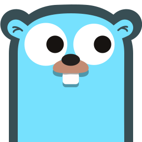 </a></td>
    <td><code>gg</code></td>
    <td>golang <a title="requires private API key" href="#optional-private-api-key-configuration">&#8727;</a></td>
    <td><a href="https://golang.org">golang.org</a></td>
    <td></td>
  </tr>
  <tr>
    <td><a href="https://github.com"> </a></td>
    <td><code>gh</code></td>
    <td>github</td>
    <td><a href="https://github.com">github.com</a></td>
    <td><a href="#github">:framed_picture:</a></td>
  </tr>
  <tr>
    <td><a href="https://www.google.com"> </a></td>
    <td><code>gi</code></td>
    <td>google-images</td>
    <td><a href="https://www.google.com">www.google.com</a></td>
    <td></td>
  </tr>
  <tr>
    <td><a href="https://www.google.com"> </a></td>
    <td><code>go</code></td>
    <td>google</td>
    <td><a href="https://www.google.com">www.google.com</a></td>
    <td></td>
  </tr>
  <tr>
    <td><a href="https://scholar.google.com"> </a></td>
    <td><code>gs</code></td>
    <td>google-scholar</td>
    <td><a href="https://scholar.google.com">scholar.google.com</a></td>
    <td></td>
  </tr>
  <tr>
    <td><a href="https://hex.pm"> </a></td>
    <td><code>hd</code></td>
    <td>hexdocs</td>
    <td><a href="https://hex.pm">hex.pm</a></td>
    <td></td>
  </tr>
  <tr>
    <td><a href="https://huggingface.co"> </a></td>
    <td><code>hf</code></td>
    <td>huggingface</td>
    <td><a href="https://huggingface.co">huggingface.co</a></td>
    <td></td>
  </tr>
  <tr>
    <td><a href="https://news.ycombinator.com"> </a></td>
    <td><code>hn</code></td>
    <td>hackernews</td>
    <td><a href="https://news.ycombinator.com">news.ycombinator.com</a></td>
    <td><a href="#hackernews">:framed_picture:</a></td>
  </tr>
  <tr>
    <td><a href="https://www.haskell.org"> </a></td>
    <td><code>ho</code></td>
    <td>hoogle</td>
    <td><a href="https://www.haskell.org">www.haskell.org</a></td>
    <td><a href="#hoogle">:framed_picture:</a></td>
  </tr>
  <tr>
    <td><a href="https://wiki.haskell.org"> </a></td>
    <td><code>hw</code></td>
    <td>haskellwiki</td>
    <td><a href="https://wiki.haskell.org">wiki.haskell.org</a></td>
    <td></td>
  </tr>
  <tr>
    <td><a href="https://hex.pm"> </a></td>
    <td><code>hx</code></td>
    <td>hex</td>
    <td><a href="https://hex.pm">hex.pm</a></td>
    <td></td>
  </tr>
  <tr>
    <td><a href="https://jquery.com"> </a></td>
    <td><code>jq</code></td>
    <td>jquery <a title="requires private API key" href="#optional-private-api-key-configuration">&#8727;</a></td>
    <td><a href="https://jquery.com">jquery.com</a></td>
    <td></td>
  </tr>
  <tr>
    <td><a href="https://kagi.com"> </a></td>
    <td><code>ka</code></td>
    <td>kagi</td>
    <td><a href="https://kagi.com">kagi.com</a></td>
    <td></td>
  </tr>
  <tr>
    <td><a href="https://developer.mozilla.org"> </a></td>
    <td><code>md</code></td>
    <td>mdn</td>
    <td><a href="https://developer.mozilla.org">developer.mozilla.org</a></td>
    <td><a href="#mdn">:framed_picture:</a></td>
  </tr>
  <tr>
    <td><a href="https://nodejs.org"> </a></td>
    <td><code>no</code></td>
    <td>node <a title="requires private API key" href="#optional-private-api-key-configuration">&#8727;</a></td>
    <td><a href="https://nodejs.org">nodejs.org</a></td>
    <td></td>
  </tr>
  <tr>
    <td><a href="https://www.npmjs.com"> </a></td>
    <td><code>np</code></td>
    <td>npm</td>
    <td><a href="https://www.npmjs.com">www.npmjs.com</a></td>
    <td></td>
  </tr>
  <tr>
    <td><a href="https://www.owasp.org"> </a></td>
    <td><code>ow</code></td>
    <td>owasp</td>
    <td><a href="https://www.owasp.org">www.owasp.org</a></td>
    <td></td>
  </tr>
  <tr>
    <td><a href="https://www.reddit.com"> </a></td>
    <td><code>re</code></td>
    <td>reddit</td>
    <td><a href="https://www.reddit.com">www.reddit.com</a></td>
    <td><a href="#reddit">:framed_picture:</a><a href="#reddit-2">:framed_picture:</a></td>
  </tr>
  <tr>
    <td><a href="https://stackexchange.com"> </a></td>
    <td><code>se</code></td>
    <td>stackexchange</td>
    <td><a href="https://stackexchange.com">stackexchange.com</a></td>
    <td></td>
  </tr>
  <tr>
    <td><a href="https://stackoverflow.com"> </a></td>
    <td><code>so</code></td>
    <td>stackoverflow</td>
    <td><a href="https://stackoverflow.com">stackoverflow.com</a></td>
    <td></td>
  </tr>
  <tr>
    <td><a href="https://www.onelook.com"> </a></td>
    <td><code>th</code></td>
    <td>thesaurus</td>
    <td><a href="https://www.onelook.com">www.onelook.com</a></td>
    <td><a href="#thesaurus">:framed_picture:</a></td>
  </tr>
  <tr>
    <td><a href="https://www.typescriptlang.org"> </a></td>
    <td><code>ts</code></td>
    <td>typescript</td>
    <td><a href="https://www.typescriptlang.org">www.typescriptlang.org</a></td>
    <td></td>
  </tr>
  <tr>
    <td><a href="https://twitter.com"> </a></td>
    <td><code>tw</code></td>
    <td>twitter</td>
    <td><a href="https://twitter.com">twitter.com</a></td>
    <td></td>
  </tr>
  <tr>
    <td><a href="https://symbl.cc"> </a></td>
    <td><code>un</code></td>
    <td>unicode <a title="requires local web server" href="#running-the-local-web-server">&#8224;</a></td>
    <td><a href="https://symbl.cc">symbl.cc</a></td>
    <td><a href="#unicode">:framed_picture:</a></td>
  </tr>
  <tr>
    <td><a href="https://vim.fandom.com"> </a></td>
    <td><code>vw</code></td>
    <td>vimwiki</td>
    <td><a href="https://vim.fandom.com">vim.fandom.com</a></td>
    <td></td>
  </tr>
  <tr>
    <td><a href="http://www.wolframalpha.com"> </a></td>
    <td><code>wa</code></td>
    <td>wolframalpha <a title="requires private API key" href="#optional-private-api-key-configuration">&#8727;</a></td>
    <td><a href="http://www.wolframalpha.com">www.wolframalpha.com</a></td>
    <td><a href="#wolframalpha">:framed_picture:</a><a href="#wolframalpha-2">:framed_picture:</a></td>
  </tr>
  <tr>
    <td><a href="https://en.wikipedia.org"> </a></td>
    <td><code>wp</code></td>
    <td>wikipedia</td>
    <td><a href="https://en.wikipedia.org">en.wikipedia.org</a></td>
    <td><a href="#wikipedia">:framed_picture:</a></td>
  </tr>
  <tr>
    <td><a href="https://simple.wikipedia.org"> </a></td>
    <td><code>ws</code></td>
    <td>wikipedia-simple</td>
    <td><a href="https://simple.wikipedia.org">simple.wikipedia.org</a></td>
    <td></td>
  </tr>
  <tr>
    <td><a href="https://en.wiktionary.org"> </a></td>
    <td><code>wt</code></td>
    <td>wiktionary</td>
    <td><a href="https://en.wiktionary.org">en.wiktionary.org</a></td>
    <td></td>
  </tr>
  <tr>
    <td><a href="https://www.yelp.com"> </a></td>
    <td><code>yp</code></td>
    <td>yelp</td>
    <td><a href="https://www.yelp.com">www.yelp.com</a></td>
    <td></td>
  </tr>
  <tr>
    <td><a href="https://www.youtube.com"> </a></td>
    <td><code>yt</code></td>
    <td>youtube <a title="requires private API key" href="#optional-private-api-key-configuration">&#8727;</a></td>
    <td><a href="https://www.youtube.com">www.youtube.com</a></td>
    <td><a href="#youtube">:framed_picture:</a></td>
  </tr>
</tbody>
</table>

<a href="#optional-private-api-key-configuration">&#8727; requires private API key</a>

<a href="#running-the-local-web-server">&#8224; requires local webserver</a>

## Installation

Requires **`Surfingkeys v1.0.0 or newer`**.

### Pre-built

_Coming soon!_

### Build and Install

#### Dependencies

- **git**
- **node.js v17**

#### Procedure

1.  **Clone**

    ```shell
    $ git clone http://github.com/b0o/surfingkeys-conf
    $ cd surfingkeys-conf
    ```

2.  **Install Node.js dependencies**

    ```shell
    $ npm install
    ```

3.  **Gulp Build/Install**

    ```shell
    $ npm run gulp install # OR "npm run gulp build" to build to ./build/surfingkeys.js without installing
    ```

    This will build the final configuration file and place it at `~/.config/surfingkeys.js`.
    If you already have a file in that location, make sure you back it up first!

4.  **Load your configuration into the SurfingKeys Extension**

    <details>
    <summary><strong>Option A</strong> <em>(recommended)</em>: Configure SurfingKeys to automatically load the configuration file</summary>
    <blockquote><details>
    <summary><strong>Local File Access (Chrome/Chromium only)</strong></summary>

    - **I.** Visit `chrome://extensions/` and enable `Allow access to file URLs` for the Surfingkeys extension.

    - **II.** Open the SurfingKeys configuration page: `chrome-extension://gfbliohnnapiefjpjlpjnehglfpaknnc/pages/options.html`.

    - **III.** Set the `Load settings from` option to point to the configuration file.

      _Note: you must specify the full, absolute path; the tilde `~` or environment variables like `$HOME` won't work_:

      - **Linux**: `file:///home/{USERNAME}/.config/surfingkeys.js` (replace `{USERNAME}` with your username)
      - **macOS**: `file:///Users/{USERNAME}/.config/surfingkeys.js` (replace `{USERNAME}` with your username)
      - **Windows**: `file://%Homedrive%%Homepath%/surfingkeys.js` (This is a guess, please correct me if I'm wrong)

    - **IV.** Repeat these steps after you make any changes to your configuration files. Your new configuration will be automatically loaded by SurfingKeys.

    </details></blockquote>
    <blockquote><details>
    <summary><strong>Local Web Server (Chrome, Chromium, and Firefox)</strong></summary>

    - **I.** Run the configuration file server:

      See [Running the Local Web Server](#running-the-local-web-server)

    - **II.** Open the SurfingKeys configuration page:

      Chrome: `chrome-extension://gfbliohnnapiefjpjlpjnehglfpaknnc/pages/options.html`

      Firefox: `moz-extension://7b04efeb-0b36-47f6-9f57-70293e5ee7b2/pages/options.html`

    - **III.** Set the `Load settings from` option to `http://localhost:9919`

    - **IV.** SurfingKeys will lose the settings as soon as the local web server shuts down. You will likely want to configure your system to automatically
      start the server on login.

      If you run Linux with systemd, an [example user service](./extra/surfingkeys-conf.service) is provided in this repo. You will need to modify
      it to contain the proper path to your `surfingkeys-conf` repo.

    - **V.** Repeat the `npm run gulp build` command from step 4 above after you make any changes to your configuration files.
      Your new configuration will be automatically loaded by the web server and SurfingKeys will pick it up the next time you load a webpage.

    </details></blockquote>
    </details>
    <details>
    <summary><strong>Option B</strong>: Manually copy/paste into the SurfingKeys configuration form</summary>

    - **I.** Copy the contents of `./build/surfingkeys.js` (or `$HOME/.config/surfingkeys.js` if you ran `gulp install`)

    - **II.** Paste the contents into the SurfingKeys configuration page:

      Chrome: `chrome-extension://gfbliohnnapiefjpjlpjnehglfpaknnc/pages/options.html`

      Firefox: `moz-extension://7b04efeb-0b36-47f6-9f57-70293e5ee7b2/pages/options.html`

    - **III.** Repeat these steps after you make any changes to your configuration files. Your new configuration will be automatically loaded by SurfingKeys.

    </details>

### Optional: Private API Key Configuration

Some omnibar search engine integrations require private API keys for access (marked with a &#8727; in [the table](#omnibar-search-engine-integrations) above).
These keys are to be defined in `./src/conf.priv.js`, which should be created based on the template: [`./src/conf.priv.example.js`](./src/conf.priv.example.js).
The template contains instructions on how to generate each API key.

Note: The `./src/conf.priv.js` does not exist in the repository, you need to copy the template file. The `conf.priv.js` should not be commited!

1. Copy the example private configuration:

```shell
$ cp ./src/conf.priv.example.js ./src/conf.priv.js
```

2. Open `./src/conf.priv.js` in your favorite editor and follow the instructions inside:

```shell
$ vim ./src/conf.priv.js
```

### Running the Local Web Server

This project provides a local web server which:

- Serves your configuration file via HTTP
- Serves additional API routes for certain search engines, like the `unicode` search engine.

To run the local web server, follow steps 1-3 in the [installation instructions above](#procedure), then run:

```shell
$ gulp serve-simple
```

Alternatively, you can use the `gulp serve` task, which also automatically rebuilds the configuration file whenever a source file is modified.

If you wish to use the local web server, you will likely want it to start automatically with your PC.
If you run Linux with systemd, an [example user service](./extra/surfingkeys-conf.service) is provided for this purpose.
You will need to modify it to contain the proper path to your `surfingkeys-conf` repo.

**Note:** This starts a local web server on `localhost:9919` which serves your built configuration file and additional API endpoints. Depending on your firewall configuration, other devices on your network may be able to read your configuration file, including any private API keys or other secrets you have configured in `conf.priv.js`. Proceed with caution.

## Screenshots

##### AUR
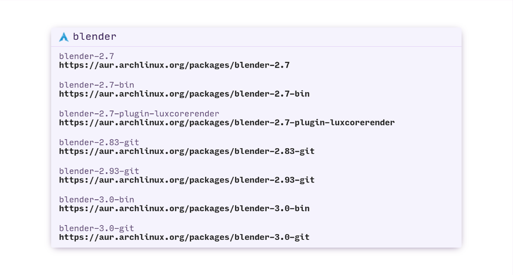

##### amazon
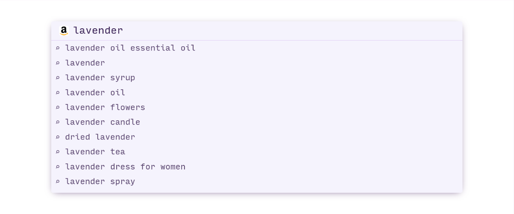

##### define
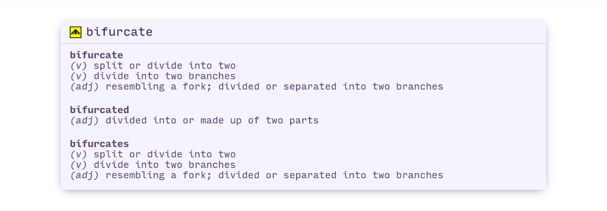

##### dockerhub
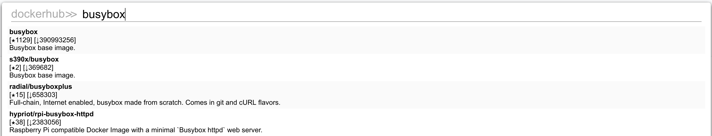

##### domainr
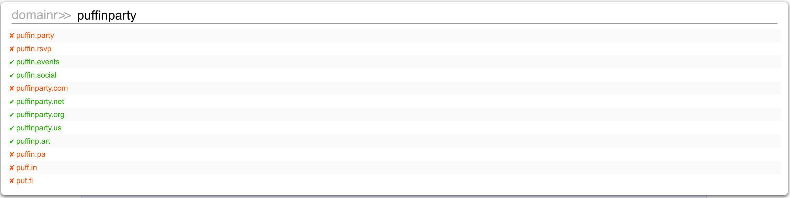

##### firefox-addons
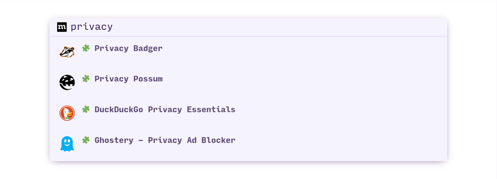

##### github
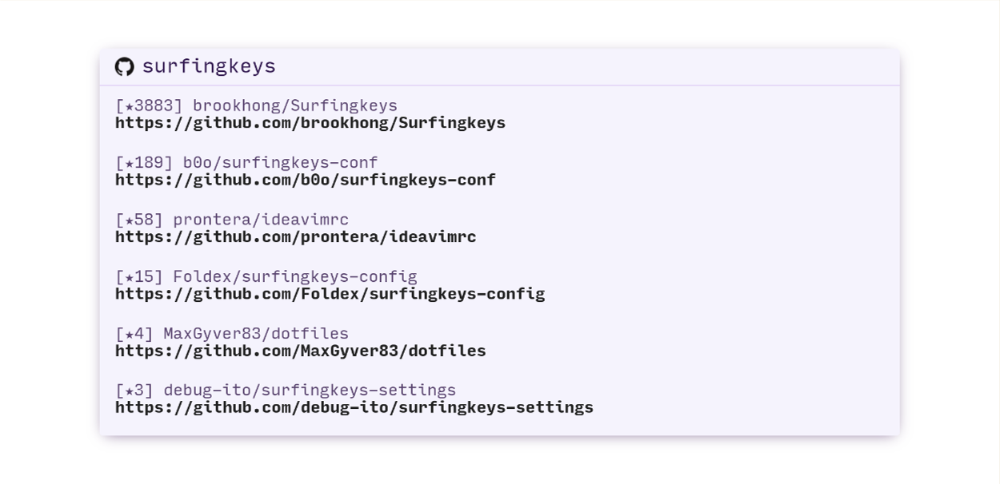

##### hackernews
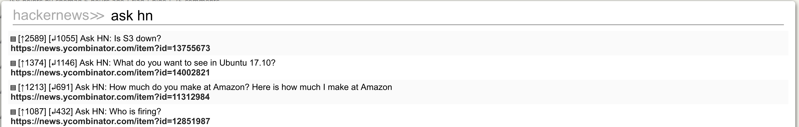

##### hoogle
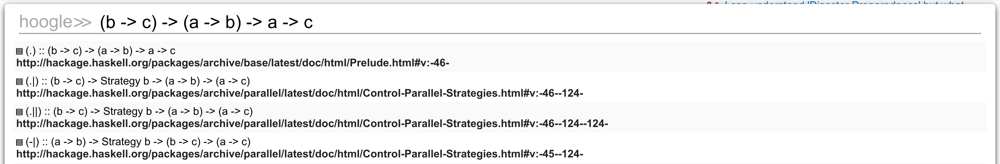

##### mdn
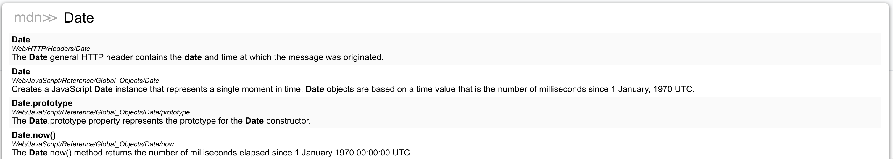

##### reddit
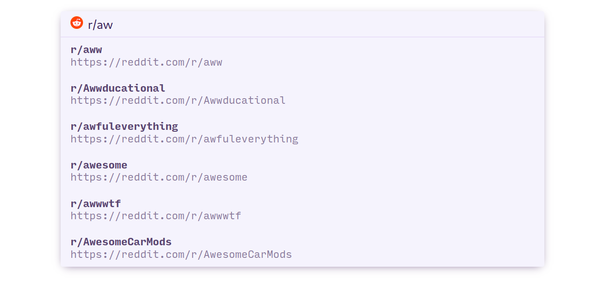

##### reddit 2
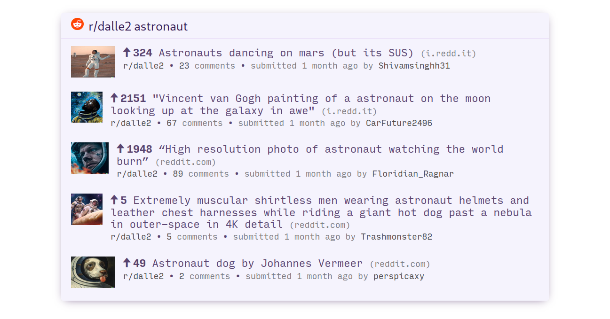

##### thesaurus
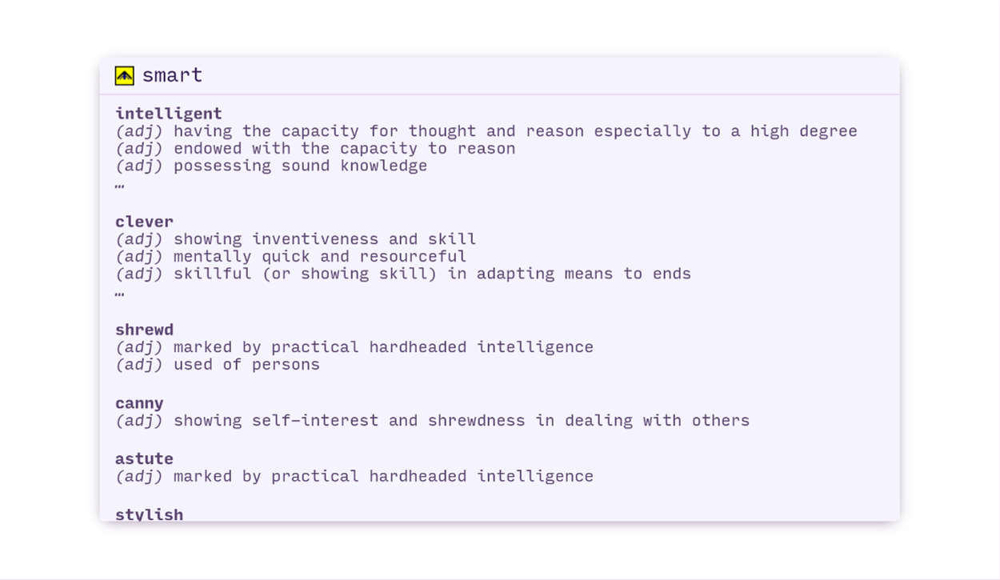

##### unicode
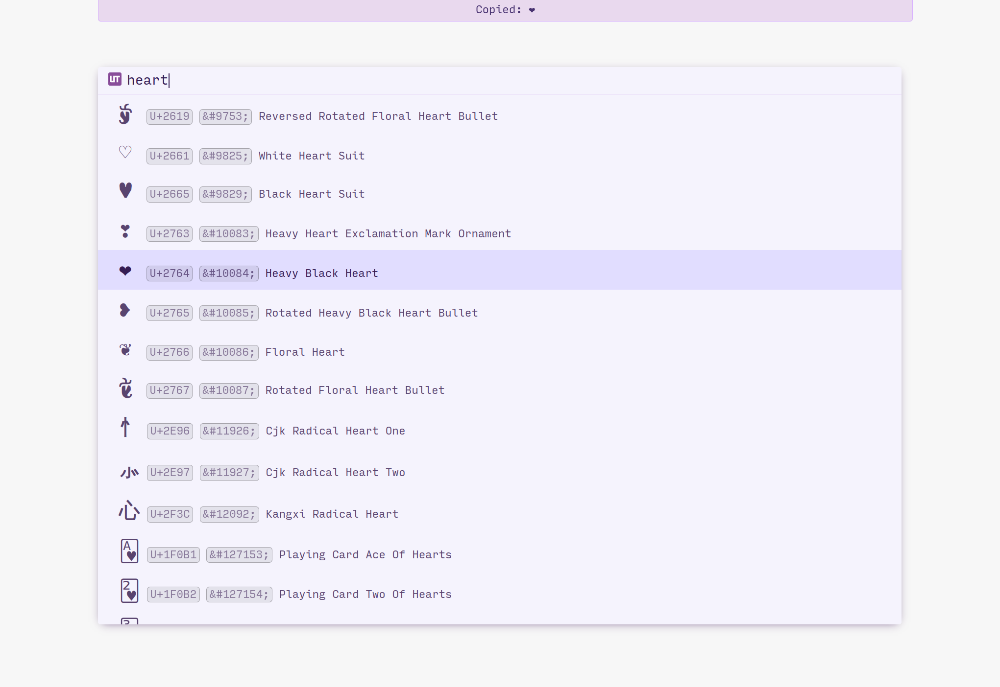

##### wolframalpha
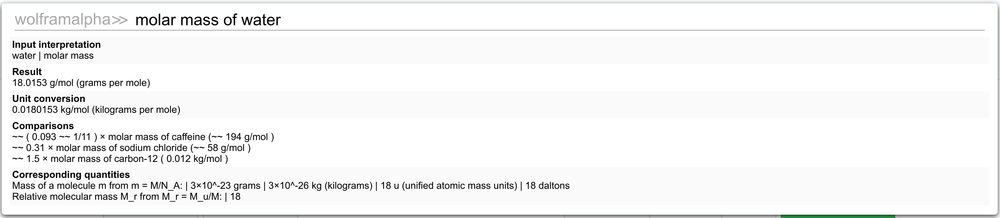

##### wolframalpha 2


##### wikipedia


##### youtube
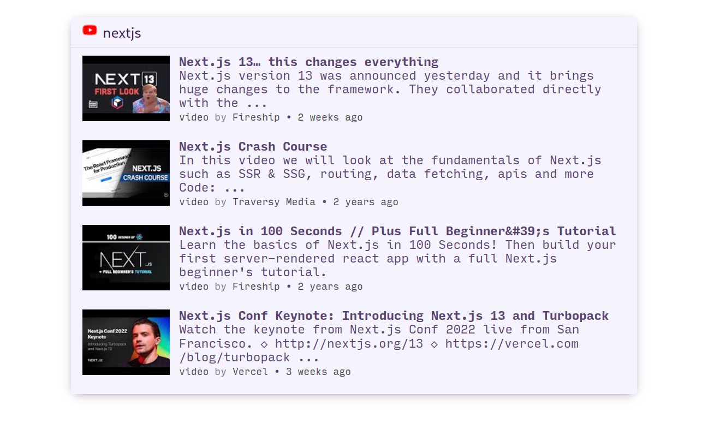


## Copyright

<p><h4>Author</h4>&copy; 2017-2024 <a href="https://github.com/b0o">Maddison Hellstrom</a></p><p><h4>License</h4>Released under the <a href="./LICENSE">MIT License</a></p>
