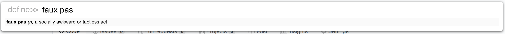
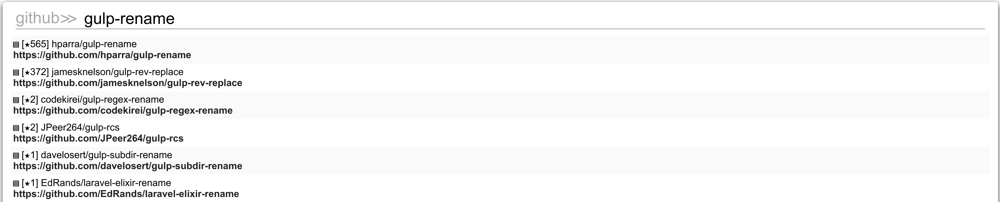
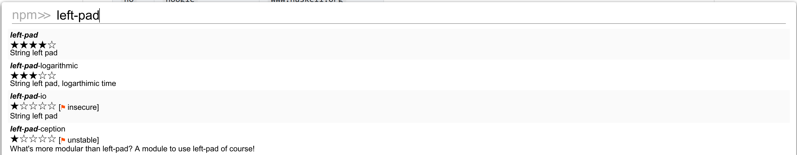
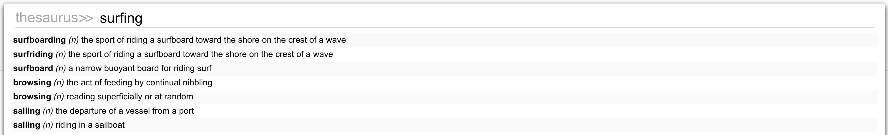
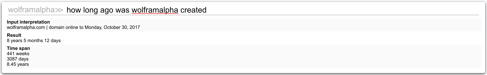
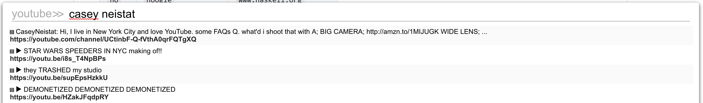

<!--DISCLAIMER-->
### Maddy's SurfingKeys Configuration

This is my personal configuration for the wonderful [SurfingKeys](https://github.com/brookhong/Surfingkeys) Chrome Extension.

#### Table of Contents

  1. [Bundled Search Engine Completions](#bundled-search-engine-completions)
  2. [Installation Instructions](#installation)
  3. [Screenshots](#screenshots)
  4. [License](#license)

#### Bundled Search Engine Completions

There are currently <!--COMPL_COUNT--> Search Engine auto-completions.

You can access a Search Engine auto-completion by pressing the search leader key, which is `a` by default, followed by the search engine alias.

For example, to open the Wikipedia completion, you would type `awp` while in normal mode.

| Alias | Name | Domain |
| ---- | ------ | ----- |
<!--COMPL_TABLE-->

#### Installation

##### Dependencies

  - `git`
  - `node`
  - `gulp`. 

##### 1. Clone

```shell
$ git clone http://github.com/b0o/surfingkeys-conf
$ cd surfingkeys-conf
```

##### 2. NPM Install

```shell
$ npm install
```

##### 3. Private API Key Configuration

Copy the example private configuration:

```shell
$ cp ./conf.priv.example.js ./conf.priv.js
```

Open `./conf.priv.js` in your favorite editor and follow the instructions inside:

```shell
$ vim ./conf.priv.js
```

##### 4. Gulp Build/Install

```shell
$ gulp install
```

This will build the final configuration file and place it in `~/.surfingkeys`.
If you already have a file in that location, make sure you back it up first!

##### 5. Load your configuration in the SurfingKeys Extension

The final step is to tell SurfingKeys where to find your configuration file:

  - __I.__ Visit [`chrome://extensions/`](chrome://extensions/) and enable `Allow access to file URLs` for the Surfingkeys extension

  - __II.__ Open the SurfingKeys [configuration page](chrome-extension://mffcegbjcdejldmihkogmcnkgbbhioid/pages/options.html)

  - __III.__ Set the `Load settings from` option to the correct path (substituting `$USER` for your username):
    - __Linux, MacOS, Unix__: `file:///home/$USER/.surfingkeys`
    - __Windows__: `file://%Homedrive%%Homepath%/.surfingkeys` (This is a guess, please correct me if I'm wrong.)

##### 6. Hack Away!

If you ever make a change to any of your configuration files in the future, simply run `gulp install` again and your settings will be immediately updated.

#### Screenshots

##### crunchbase-people


##### define


##### dockerhub


##### domainr


##### github


##### hackernews


##### hoogle


##### mdn


##### npm


##### thesaurus


##### wolframalpha


##### wolframalpha


##### youtube


### License
&copy;2017 Maddison Hellstrom - MIT License
